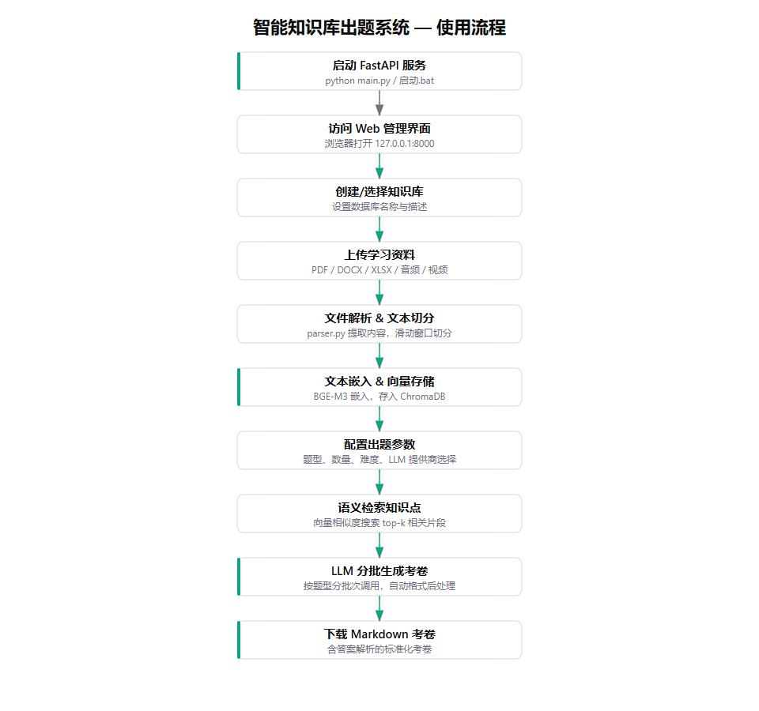

# 智能知识库出题系统

基于 RAG（检索增强生成）的本地出题系统。上传文档/音频/视频后，自动构建向量知识库，支持按题型、按数据库灵活配置，调用大模型生成带解析的标准化考卷。

---

## 功能特性

| 功能 | 说明 |
|------|------|
| **多文件上传** | 支持 PDF、Word、Excel、PPT、TXT、Markdown、音频（MP3/WAV/M4A）、视频（MP4/AVI/MOV/MKV） |
| **多数据库管理** | 可创建多个独立知识库，按业务/科目分类管理 |
| **多库联合出题** | 支持单库出题或多库合并出题，知识来源灵活组合 |
| **多题型配置** | 单选题、多选题、判断题、简答题，可自由组合题量和分值 |
| **分批生成** | 大量题目自动分批调用 LLM，避免输出截断，确保题量完整 |
| **格式统一** | 自动后处理 AI 输出，去除引用块、统一答案格式、自动生成答案速查表 |
| **Web 前端** | 开箱即用的管理界面，无需额外部署前端服务 |

---

## 使用流程



---

## 技术栈

- **后端**: FastAPI + Uvicorn
- **向量数据库**: ChromaDB
- **Embedding 模型**: BGE-M3（本地加载，无需联网）
- **语音转文字**: OpenAI Whisper（本地加载）
- **大模型**: MiniMax API（需要 API Key）
- **视频处理**: FFmpeg

---

## 目录结构

```
exam-generator/
├── config.py              # 系统配置（模型路径、文件类型、API 配置）
├── models.py              # Pydantic 数据模型（请求/响应定义）
├── embedding.py           # BGE-M3 向量模型封装
├── database.py            # 多 ChromaDB 向量数据库管理
├── parser.py              # 文件解析器（文档/音频/视频）
├── exam.py                # 多题型考题生成引擎
├── main.py                # FastAPI 主服务入口
├── requirements.txt       # Python 依赖
├── .env.template          # 环境变量模板
├── static/
│   └── index.html         # Web 管理界面
├── storage/
│   ├── files/             # 上传的原始文件
│   ├── vectors/           # 向量数据库持久化数据
│   └── exams/             # 生成的考卷文件
├── models/                # AI 模型文件夹（手动放置）
│   ├── bge-m3/            # Embedding 模型
│   └── whisper/           # 语音转文字模型
└── README.md              # 本文件
```

---

## 部署步骤

### 1. 环境要求

- Python 3.11 或更高版本
- Windows / Linux / macOS
- 至少 8GB 内存（加载 BGE-M3 模型需要）
- 磁盘空间：模型文件约 2.5GB + 向量数据

### 2. 安装 Python 依赖

```bash
cd exam-generator
pip install -r requirements.txt
```

如果 `openai-whisper` 安装失败，可单独安装：

```bash
pip install openai-whisper
```

### 3. 准备 AI 模型（必须）

项目需要 3 个外部资源，**不会自动下载**，必须手动准备：

#### 3.1 BGE-M3 模型（文本向量化，约 2.3GB）

放到 `models/bge-m3/` 目录下。

**没有模型？手动下载：**

- 方式 A（HuggingFace）：`huggingface-cli download BAAI/bge-m3 --local-dir models/bge-m3`
- 方式 B（ModelScope 国内镜像）：`python -c "from modelscope import snapshot_download; snapshot_download('BAAI/bge-m3', local_dir='models/bge-m3')"`
- 方式 C（手动）：访问 https://huggingface.co/BAAI/bge-m3 下载 `pytorch_model.bin`、`config.json`、`tokenizer.json` 等文件放到 `models/bge-m3/`

确认模型就绪（`models/bge-m3/` 目录下应有 `config.json`、`pytorch_model.bin`、`tokenizer.json` 等文件）。

#### 3.2 Whisper base 模型（语音转文字，约 150MB）

放到 `models/whisper/base.pt`。

**没有模型？** 首次运行时会自动下载到 `~/.cache/whisper/`，然后手动复制到 `models/whisper/base.pt`。

#### 3.3 FFmpeg（视频处理，约 50MB）

FFmpeg 是独立的可执行程序，不是 Python 包。

**Windows 安装方式：**

```powershell
# 方式 A（Chocolatey）
choco install ffmpeg

# 方式 B（winget）
winget install Gyan.FFmpeg

# 方式 C（手动下载解压）
# 1. 从 https://github.com/BtbN/FFmpeg-Builds/releases 下载 ffmpeg-master-latest-win64-gpl.zip
# 2. 解压到 exam-generator/ 目录下（保留文件夹结构，如 ffmpeg-xxx-essentials_build/bin/ffmpeg.exe）
```

**Linux/macOS：**
```bash
# Ubuntu/Debian
sudo apt update && sudo apt install ffmpeg

# macOS
brew install ffmpeg
```

验证 FFmpeg 安装：
```bash
ffmpeg -version
```

### 4. 配置 API Key

项目依赖 MiniMax 大模型 API 生成考题，必须配置 API Key。

```bash
# 复制模板
cp .env.template .env

# 编辑 .env 文件，填入你的 API Key
```

`.env` 文件内容示例：
```ini
MINIMAX_API_KEY=your_api_key_here
MINIMAX_BASE_URL=https://api.minimax.chat/v1
MINIMAX_MODEL=MiniMax-M2.7
```

> 如何获取 MiniMax API Key？
> 1. 访问 https://www.minimaxi.com/
> 2. 注册并登录开发者平台
> 3. 在「控制台」→「API Key」中创建并复制

### 5. 启动服务

```bash
python main.py
```

首次启动时会加载 BGE-M3 模型，约需 10~30 秒（取决于磁盘速度）。

启动成功后终端显示：
```
[INFO] 使用本地 BGE-M3 模型: D:\...\exam-generator\models\bge-m3
[INFO] 使用本地 Whisper 模型: D:\...\exam-generator\models\whisper\base.pt
[INFO] 使用本地 FFmpeg: D:\...\exam-generator\ffmpeg-...\bin\ffmpeg.exe
INFO:     Started server process [xxxxx]
INFO:     Uvicorn running on http://0.0.0.0:8000
```

### 6. 访问系统

打开浏览器访问：

- **Web 管理界面**: http://localhost:8000
- **API 文档（Swagger）**: http://localhost:8000/docs

---

## 使用指南

### 方式一：Web 界面（推荐）

打开 http://localhost:8000，按以下步骤操作：

1. **数据库管理** → 创建新的知识库（如"业务培训资料"）
2. **文件上传** → 选择目标数据库，上传 PDF/Word/PPT/视频等文件
3. **生成考题** → 配置：
   - 考卷标题
   - 搜索关键词（每行一个，如"企业战略"、"风险防范"）
   - 题型设置（添加单选/多选/判断/简答，设置数量和分值）
   - 数据库选择（单库或多库联合）
   - 考试时间、合格线
4. 点击「生成考卷」，等待 LLM 生成后预览和下载

### 方式二：HTTP API

```bash
# 1. 创建数据库
curl -X POST http://localhost:8000/api/databases \
  -H "Content-Type: application/json" \
  -d '{"db_id":"business","name":"业务知识库"}'

# 2. 上传文件
curl -X POST http://localhost:8000/api/upload \
  -F "file=@your_document.pdf" \
  -F "db_id=business"

# 3. 生成考卷
curl -X POST http://localhost:8000/api/exam/generate \
  -H "Content-Type: application/json" \
  -d '{
    "title": "业务培训考题",
    "db_ids": ["business"],
    "queries": ["企业发展战略", "风险防范"],
    "question_types": [
      {"type": "single_choice", "count": 20, "score_per_question": 2},
      {"type": "multi_choice", "count": 10, "score_per_question": 3},
      {"type": "judge", "count": 10, "score_per_question": 2}
    ],
    "exam_time": "60分钟",
    "passing_score": 60
  }'
```

更多 API 详见 Swagger 文档：http://localhost:8000/docs

---

## 核心 API 端点

| 端点 | 方法 | 功能 |
|------|------|------|
| `/api/databases` | GET | 列出所有数据库 |
| `/api/databases` | POST | 创建数据库 |
| `/api/databases/{db_id}` | DELETE | 删除数据库 |
| `/api/upload` | POST | 上传单个文件 |
| `/api/upload/batch` | POST | 批量上传文件 |
| `/api/search` | POST | 知识库语义搜索 |
| `/api/exam/generate` | POST | 生成考卷 |
| `/api/exam/list` | GET | 考卷历史列表 |
| `/api/exam/download/{filename}` | GET | 下载考卷文件 |

---

## 常见问题

### Q1: 启动时报错 "找不到 BGE-M3 模型"

检查 `models/bge-m3/` 目录下是否有 `config.json`、`pytorch_model.bin`、`tokenizer.json`。如果没有，按【部署步骤 → 3.1】手动下载模型文件。

### Q2: 上传音频/视频后没有内容

检查 FFmpeg 是否正确安装：`ffmpeg -version`。如果没有，按【部署步骤 → 3.3】安装 FFmpeg。

### Q3: 生成考卷时提示 "未检索到任何知识内容"

- 确认已上传文件到数据库
- 确认搜索关键词与文档内容相关
- 在「数据库管理」页面查看数据库的 `document_count` 是否大于 0

### Q4: 生成的题目数量不够

系统已自动采用分批生成策略（每批最多 25 道），如果仍不足，通常是 LLM API 输出被截断。可以尝试：
- 减少每次生成的题目数量
- 检查 API Key 的额度是否充足

### Q5: 如何更换 Embedding 模型？

编辑 `config.py` 第 26~39 行，修改 `BGE_M3_CANDIDATES` 列表中的模型路径。注意：更换后需清空 `storage/vectors/` 目录重新入库，因为不同模型的向量不兼容。

### Q6: 如何更换 LLM（不用 MiniMax）？

编辑 `exam.py` 中的 `LLMClient` 类，修改 `base_url`、`headers` 和请求格式以适配其他 API（如 OpenAI、通义千问、文心一言等）。同时修改 `config.py` 中的 `MINIMAX_*` 配置。

---

## 注意事项

1. **MiniMax API Key 是必需的**，没有 Key 无法生成考卷（向量入库和搜索不依赖 API Key）
2. **模型文件不会被提交到 Git**，`models/` 目录应在 `.gitignore` 中
3. **向量数据库数据存储在 `storage/vectors/`**，迁移项目时需一并复制
4. **上传的原始文件保存在 `storage/files/`**
5. **生成的考卷保存在 `storage/exams/`**

---

## 版本信息

- **版本**: v2.0.0
- **更新日期**: 2026-04-28
- **端口**: 8000
